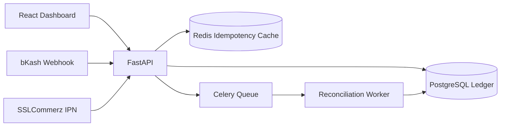

# Hisab — Double-Entry Ledger & Payment Reconciliation

A correctness-first ledger and reconciliation system for Bangladeshi businesses that receive money through bKash, SSLCommerz, bank transfers, and cash on delivery.

**Live demo:** _coming soon_ · **Demo video:** _coming soon_

---

## The Problem

Businesses in Bangladesh collect payments from many channels, and their records rarely match:
- Retried payment requests get counted twice.
- Webhooks arrive late, out of order, or more than once.
- Hundreds of transactions like "01711xxxxxx paid ৳1,450" can't be linked to an order.

## The Solution

Hisab records every movement of money as a **balanced double-entry transaction**, guarantees **exactly-once processing** with idempotency keys, and uses **AI-assisted matching** to reconcile unmatched payments.

## Key Features

- **Double-entry ledger:** every transaction's debits equal its credits, enforced at the database level
- **Idempotent APIs:** retried requests never create duplicate transactions
- **Concurrency-safe balances:** no race conditions under heavy parallel writes
- **Payment integrations:** bKash (sandbox) and SSLCommerz (sandbox) with safe webhook handling
- **Reconciliation engine:** rule-based plus embedding-based matching of payments to orders
- **Audit trail:** append-only records; entries are reversed, never edited or deleted
- **Dashboard:** balances, unmatched transactions, and a manual review queue

## Architecture



## Tech Stack

| Layer | Technology |
|---|---|
| Backend | Python, FastAPI, SQLAlchemy, Alembic |
| Database | PostgreSQL |
| Cache & Queue | Redis, Celery |
| AI Matching | sentence-transformers |
| Frontend | React, Vite, Tailwind CSS |
| Testing | pytest, Locust / k6 |
| DevOps | Docker, GitHub Actions |

## Project Structure

```
hisab/
├── backend/
│   ├── app/
│   │   ├── api/              # Route handlers
│   │   ├── core/             # Config, database, security
│   │   ├── models/           # SQLAlchemy models
│   │   ├── schemas/          # Pydantic schemas
│   │   ├── services/
│   │   │   ├── ledger/       # Double-entry logic
│   │   │   ├── payments/     # bKash, SSLCommerz adapters
│   │   │   └── reconciliation/
│   │   ├── workers/          # Celery tasks
│   │   └── main.py
│   ├── alembic/
│   ├── tests/
│   └── requirements.txt
├── frontend/
├── benchmarks/               # Load and concurrency tests
├── docs/                     # Design decisions
├── docker-compose.yml
├── .env.example
└── README.md
```

## Getting Started

### Prerequisites
- Python 3.12+
- Node.js 20+
- Docker Desktop

### Setup (Windows PowerShell)

```powershell
git clone https://github.com/<your-username>/hisab.git
cd hisab

# Start PostgreSQL and Redis
docker compose up -d

# Backend
cd backend
python -m venv .venv
.\.venv\Scripts\Activate.ps1
pip install -r requirements.txt
copy ..\.env.example .env
alembic upgrade head
uvicorn app.main:app --reload
```

In a second terminal:

```powershell
cd backend
.\.venv\Scripts\Activate.ps1
celery -A app.workers.celery_app worker --pool=solo --loglevel=info
```

In a third terminal:

```powershell
cd frontend
npm install
npm run dev
```

API docs: http://localhost:8000/docs

## Example: Create a Transaction

```http
POST /api/v1/transactions
Idempotency-Key: 7f3c9a2e-order-1045

{
  "description": "bKash payment for order #1045",
  "entries": [
    { "account": "bkash_wallet", "direction": "debit",  "amount": 145000 },
    { "account": "sales_revenue", "direction": "credit", "amount": 145000 }
  ]
}
```

Amounts are stored as integers in **poisha** (৳1 = 100 poisha) to avoid floating-point errors.

## Design Decisions

| Decision | Reason |
|---|---|
| Integer amounts in poisha | Floats cause rounding errors with money |
| Append-only entries | Full audit history; mistakes are fixed with reversal entries |
| Idempotency keys stored in PostgreSQL + Redis | Fast duplicate checks with a durable fallback |
| Row-level locking on balance updates | Prevents race conditions during concurrent writes |
| Webhooks verified, then processed asynchronously | Fast acknowledgement and safe retries |

Details are in [`docs/`](docs/).

## Benchmarks

| Test | Result |
|---|---|
| Concurrent transactions processed | TBD |
| Balance drift after load test | TBD |
| Duplicate transactions from retries | TBD |
| p95 API latency | TBD |
| Auto-matched unreconciled payments | TBD |

_Results will be added after load testing._

## Roadmap

- [ ] Core ledger with double-entry validation
- [ ] Idempotency layer
- [ ] Concurrency tests
- [ ] bKash sandbox integration
- [ ] SSLCommerz sandbox integration
- [ ] Rule-based reconciliation
- [ ] AI-assisted matching
- [ ] Dashboard
- [ ] Load testing and benchmarks
- [ ] Deployment

## License

MIT

## Author

**Amifat Juhad Pranto** · [LinkedIn](#) · [Email](mailto:amifatjuhad@gmail.com)
